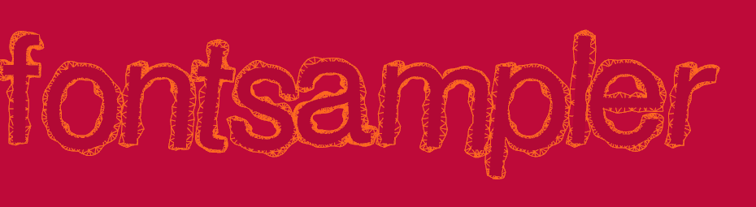

# ofxFontSampler

**ofxFontSampler** is a *TrueType Font* (TTF) glyph path extractor and renderer designed to finely sample glyphes from a font.

It was somewhat inspired by Ken Perlin's blog post [*"Unfont Design"*](http://blog.kenperlin.com/?p=16961).

### Overview

The project consist of two parts : 

* **FontSampler**, a *TrueType Font* (TTF) file parser and a glyph path extractor designed to handle type 4 CMAP format and working as a standalone c++ library.
* **ofxFontSampler**, an openframework addons interfacing with *FontSampler*.

### Example

The example consists of two demos you can switch using the mouse left-click. It relies on the [ofxTriangleMesh](https://github.com/tcoppex/ofxTriangleMesh) addon to triangulate meshes.

#### Demo 1 : Latin charset letters

Display iteratively the 26 uppercase letters of the latin charset (*A to Z*) with different animated contour sampling.

#### Demo 2 : ofxRenderFont

Display a 3d text with dynamic extrusion on the z-axis using the *ofxRenderFont* utility class.

### Limitations

* **FontSampler** is intended to be used at the glyph (*ie. character*) level, you can certainly write text with it but no support is given.
* It was designed to handle TTF using **type 4 CMAP** (*cf. TrueType Reference*). Most TrueType fonts support it, but some don't.
* Composites glyphes, like letters with accent (*eg. "é"*), are not supported.
* It is more of a working prototype which would need work on the memory management side to be production ready.

### References

- [Apple's TrueType Reference Manual](https://developer.apple.com/fonts/TrueType-Reference-Manual/)
- [The OpenType Font File](https://www.microsoft.com/typography/otspec/otff.htm)
- [An Introduction to TrueType Fonts: A look inside the TTF format](http://scripts.sil.org/cms/scripts/page.php?site_id=nrsi&id=iws-chapter08)

### Acknowledgement

The example is distributed with a typeface from *GNU FreeFont* used under the **GNU General Public License**. You can read more about it and obtain a free copy [here](https://www.gnu.org/software/freefont/index.html).

## License

*ofxFontSampler* is released under the **MIT License**.
